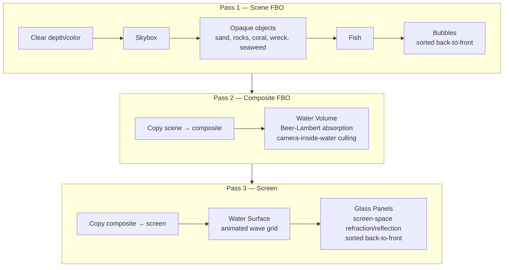

# Aquarium 3D


> Simulasi akuarium 3D interaktif dengan grafika real-time, dibangun menggunakan ModernGL dan Pygame.

Akuarium 3D adalah proyek grafika komputer yang menampilkan rendering OpenGL 3.3 Core Profile secara real-time. Seluruh aset bersifat prosedural — tidak ada model 3D eksternal yang diimpor. Dari ikan dengan animasi renang berbasis gelombang berjalan, hingga pasir dengan displacement map dan proyeksi caustics Voronoi, volumetric water dengan Beer-Lambert absorption, serta panel kaca dengan refraksi/refleksi screen-space — semua digenerasi dan dirender dalam satu pipeline multi-pass.

## ✨ Fitur Utama

- **Scene bawah air prosedural** — dasar pasir dengan height-map displacement CPU noise, bebatuan, koral, rumput laut dengan animasi sway, bangkai kapal dengan peti harta karun, dan gugusan anemon laut
- **Ikan realistik** — mesh prosedural high-detail (badan, 4 sirip, mata, tutup insang, lateral line), 6 spesies warna berbeda, animasi renang gelombang berjalan, AI random, dan flee-on-click behavior
- **Volumetric water** — depth-aware Beer-Lambert absorption volume dengan 3 preset warna (Deep Ocean, Tropical Teal, Mediterranean)
- **Permukaan air animasi** — wave displacement 3-layer simplex noise dengan amplitude/frequency/speed yang dapat diatur
- **Refraksi & refleksi kaca** — screen-space glass panel dengan tint, Fresnel, IOR, absorption color, imperfection map, dan normal map
- **Caustics terproyeksi** — Voronoi-based caustic projection dengan sun spotlight falloff pada semua permukaan opaque
- **Kamera dual-mode** — Orbit (RMB drag, scroll zoom, MMB pan) dan FPS (WASD + mouse look), switching halus dengan TAB
- **HUD interaktif** — Pygame overlay bertema bioluminescent dengan live counters, daftar objek scene, toggle layer rendering 8 tombol (F1-F8), dan draggable slider (fish target, wave amplitude/frequency/speed)
- **Presentasi terstruktur** — 8 layer rendering independen (F1-F8) untuk mengisolasi skybox, scene opaque, ikan, bubble, water volume, water surface, glass, dan lighting/caustics

## 🏗️ Arsitektur & Tech Stack

### Arsitektur Aplikasi

```
main.py (AquariumEngine)
 │
 ├─ src/engine/            — Core engine
 │   ├─ simulation.py      — State simulation (pause, wave params, water presets, layer toggles)
 │   ├─ input_handler.py   — Event routing keyboard/mouse
 │   ├─ shader_program.py  — Loader GLSL dari shaders/
 │   ├─ vbo.py             — Generasi mesh prosedural (414 baris)
 │   ├─ vao.py             — Mapping VBO ↔ shader (14 VAOs)
 │   └─ lib/shape.py       — Geometri builder ikan (617 baris)
 │
 ├─ src/components/        — Komponen reusable
 │   ├─ camera.py          — Kamera Orbit + FPS, smooth switching
 │   ├─ lighting.py        — AquariumLight (posisi, intensitas, Ia/Id/Is)
 │   ├─ mesh.py            — Thin wrapper VAO
 │   ├─ hud.py             — HUD Pygame bioluminescent (591 baris)
 │   └─ point_light.py     — PointLight dataclass
 │
 ├─ src/objects/           — Objek scene yang dapat dirender
 │   ├─ model.py           — 7 kelas model: BaseModel, SolidModel, GlassPanel, GlueSeam,
 │   │                       SandFloor, Seaweed, WaterSurface, Fish, Bubble
 │   ├─ scene.py           — Konstruksi tank + runtime management objek
 │   ├─ skybox.py          — Cubemap skybox 6-face
 │   └─ water_volume.py    — Beer-Lambert volumetric water
 │
 ├─ src/renderer.py        — Pipeline rendering multi-pass
 ├─ src/mesh/fish_body_vbo.py — Mesh VBO ikan detail tinggi (564 baris)
 ├─ shaders/               — 10 program GLSL (20 file)
 └─ assets/materials/      — Skybox cubemap, sand textures (PBR), glass maps
```

### Render Pipeline (Multi-pass)



### Tech Stack

| Kategori | Teknologi |
|---|---|
| **Bahasa** | Python 3.11+ |
| **Graphics API** | ModernGL 5.12.0 (OpenGL 3.3 Core) |
| **Windowing & Input** | Pygame 2.6.1 |
| **3D Math** | PyGLM 2.8.3 |
| **Numerical** | NumPy 2.4.4 |
| **GL Context** | glcontext 3.0.0 |
| **Package Manager** | uv (primary) / pip |
| **Shading Language** | GLSL #version 330 core |

## 🎨 Program Shader

| Program | Vertex | Fragment | Fungsi |
|---|---|---|---|
| `skybox` | ✓ | ✓ | Cubemap background, view translation stripped |
| `water_volume` | ✓ | ✓ | Beer-Lambert absorption, depth-aware ray-box intersection, simplex noise surface |
| `water_surface` | ✓ | ✓ | Wave displacement 3-layer noise |
| `phong_color` | ✓ | ✓ | Phong solid color + wave distortion |
| `glass` | ✓ | ✓ | Screen-space refraction/reflection, IOR, Fresnel, tint, imperfection maps |
| `sand` | ✓ | ✓ | Textured PBR sand, normal/roughness/height maps, Voronoi caustics |
| `fish` | ✓ | ✓ | Travelling wave vertex displacement, Jacobian normal correction, 3-color species |
| `seaweed` | ✓ | ✓ | Animated swaying |
| `bubble` | ✓ | ✓ | Fresnel transparent sphere |
| `default_color` | ✓ | ✓ | Fallback solid color |

## 🔄 Rendering Pipeline — Deep Dive

Proyek ini mengimplementasikan **deferred-style multi-pass rendering** dengan 3 framebuffer objects:

1. **Scene Pass** — Render semua objek ke `scene_fbo` (color + depth):
   - Skybox tanpa depth test
   - Objek opaque (sand, rocks, coral, wreck, seaweed) dengan depth test + face culling
   - Ikan dengan depth test + face culling
   - Bubble diurutkan back-to-front, tanpa face culling, alpha blend

2. **Composite Pass** — Salin scene color ke `composite_fbo`, lalu blend water volume (Beer-Lambert) dengan culling otomatis berdasarkan posisi kamera (inside/outside water).

3. **Screen Pass** — Salin composite ke screen, render water surface (transparent, `depth_func <=`), lalu glass panels (screen-space refraction ambil sampel composite color, reflection ambil sampel skybox, diurutkan back-to-front).

### Efek Utama

- **Animasi Ikan**: Travelling sine wave dari kepala ke ekor dengan amplitude envelope. Normal direkalkulasi via Jacobian matrix di vertex shader.
- **Procedural Caustics**: Voronoi noise diproyeksikan dari arah matahari, dengan spotlight falloff + depth fade, diterapkan di fragment shader pasir.
- **Water Volume**: Ray-marching Beer-Lambert absorption dengan depth reconstruction dari scene depth buffer. Surface intersection menggunakan simplex noise.
- **Glass**: Refraction mengambil sampel `composite_color` dengan offset UV based on normal, reflection mengambil sampil skybox cubemap. Fresnel effect menggunakan pendekatan Schlick.

## 📋 Prerequisites

- **Python 3.11** atau lebih baru
- GPU dengan dukungan **OpenGL 3.3 Core Profile**
- Sistem operasi: Windows / Linux / macOS

## 🚀 Instalasi & Setup

### 1. Clone Repository

```bash
git clone https://github.com/your-username/aquarium-opengl.git
cd aquarium-opengl
```

### 2. Install Dependencies

Menggunakan uv (direkomendasikan):

```bash
uv sync
```

Menggunakan pip:

```bash
pip install -r requirements.txt
```

## 💻 Menjalankan Project

```bash
python main.py
```

## 🎮 Kontrol

### Kamera

| Input | Aksi |
|---|---|
| **RMB drag** | Rotate orbit |
| **Scroll Wheel** | Zoom |
| **MMB drag** | Pan |
| **TAB** | Toggle Orbit / FPS camera |
| **WASD + Q/E** | FPS movement (naik/turun) |
| **R** | Reset camera ke posisi awal |

### Simulasi

| Input | Aksi |
|---|---|
| **SPACE** | Pause / Play simulasi |
| **B** | Spawn bubble manual |
| **F** | Spawn ikan manual |
| **UP / DOWN** | Wave speed + / - |
| **LEFT / RIGHT** | Maksimum bubble + / - |
| **Z / X** | Light intensity + / - |
| **1 / 2 / 3** | Water color preset (Deep Ocean / Tropical Teal / Mediterranean) |

### Render Layers (Presentasi)

| Input | Layer |
|---|---|
| **F1** | Toggle skybox |
| **F2** | Toggle opaque scene (pasir, koral, dll) |
| **F3** | Toggle ikan |
| **F4** | Toggle bubble |
| **F5** | Toggle water volume |
| **F6** | Toggle water surface |
| **F7** | Toggle glass |
| **F8** | Toggle lighting / caustics |
| **ESC** | Keluar |

## 🖱️ Interaksi

- **Klik pada kaca** — Ikan dalam radius 3 unit dari titik klik akan kabur (flee) dengan kecepatan 5x selama 1.5 detik
- **HUD hamburger menu** — Tombol di pojok kanan bawah membuka panel slider interaktif

## 🔧 Konfigurasi Interaktif

Panel HUD (tombol hamburger di kanan bawah) menyediakan slider:

| Slider | Rentang | Default |
|---|---|---|
| Fish Target | 0 – 16 | 8 |
| Wave Amplitude | 0.0 – 0.15 | 0.060 |
| Wave Frequency | 0.0 – 4.0 | 1.00 |
| Wave Speed | 0.0 – 2.5 | 1.0 |

### Water Color Presets

| Key | Nama | Warna (R, G, B) |
|---|---|---|
| 1 | Deep Ocean | (0.04, 0.18, 0.32) |
| 2 | Tropical Teal | (0.05, 0.25, 0.22) |
| 3 | Mediterranean | (0.10, 0.20, 0.38) |

## 📁 Struktur Project

```
aquarium-opengl/
├── main.py                    # Entry point: AquariumEngine + game loop
├── pyproject.toml             # Metadata project & dependencies
├── requirements.txt           # Dependencies pip
├── uv.lock                    # Lockfile uv
├── .python-version            # Python 3.11
│
├── src/
│   ├── renderer.py            # Pipeline rendering multi-pass (3 FBOs)
│   ├── engine/
│   │   ├── simulation.py      # State simulation
│   │   ├── input_handler.py   # Event routing keyboard & mouse
│   │   ├── input_manager.py   # (Legacy) alternatif input
│   │   ├── shader_program.py  # Loader GLSL
│   │   ├── vbo.py             # Generasi mesh prosedural
│   │   ├── vao.py             # Mapping VAO ↔ shader
│   │   └── lib/
│   │       └── shape.py       # Builder geometri ikan (body, fins, eyes, dll)
│   ├── components/
│   │   ├── camera.py          # Orbit + FPS camera modes
│   │   ├── lighting.py        # AquariumLight (posisi, intensitas)
│   │   ├── mesh.py            # Wrapper VAO
│   │   ├── hud.py             # Pygame HUD bioluminescent
│   │   └── point_light.py     # Point light dataclass
│   ├── objects/
│   │   ├── scene.py           # Konstruksi tank + runtime management
│   │   ├── model.py           # 7 kelas model renderable
│   │   ├── skybox.py          # Cubemap skybox
│   │   └─ water_volume.py    # Beer-Lambert volumetric water
│   └── mesh/
│       └── fish_body_vbo.py   # Ikan mesh detail tinggi (VBO)
│
├── shaders/                   # 10 program GLSL (20 file)
│   ├── skybox.vert / .frag
│   ├── water_volume.vert / .frag
│   ├── water_surface.vert / .frag
│   ├── phong_color.vert / .frag
│   ├── glass.vert / .frag
│   ├── sand.vert / .frag
│   ├── fish.vert / .frag
│   ├── seaweed.vert / .frag
│   ├── bubble.vert / .frag
│   └── default_color.vert / .frag
│
├── assets/materials/
│   ├── skybox/sky_10_cubemap_2k/  # Cubemap 6 wajah
│   ├── sand/                      # PBR textures (albedo, normal, roughness, displacement)
│   └── glass/                     # Imperfection color, opacity, normal maps
│
└── docs/
    ├── PROJECT_MEMORY.md          # Catatan development & arsitektur
    └── superpowers/specs/         # Spesifikasi fitur
```

## 🧪 Testing

Proyek ini belum memiliki automated tests. Verifikasi dilakukan secara visual dengan menjalankan `main.py` dan menguji setiap fitur interaktif.

## 🤝 Kontribusi

Kontribusi sangat diterima! Silakan buka *issue* atau *pull request* untuk perbaikan, fitur baru, atau optimisasi.

### Contributors

Terima kasih kepada seluruh kontributor yang telah berkontribusi pada proyek ini:

| Avatar | Username | Profil |
|--------|----------|--------|
| 👤 | **raihannurhidayat** | [@raihannurhidayat](https://github.com/raihannurhidayat) |
| 👤 | **severusDude** | [@severusDude](https://github.com/severusDude) |
| 👤 | **Rigelyon** | [@Rigelyon](https://github.com/Rigelyon) |
| 👤 | **rhenaald** | [@rhenaald](https://github.com/rhenaald) |
| 👤 | **studentsinformatics23** | [@studentsinformati...](https://github.com/studentsinformatics23) |

## 📄 Lisensi

MIT
